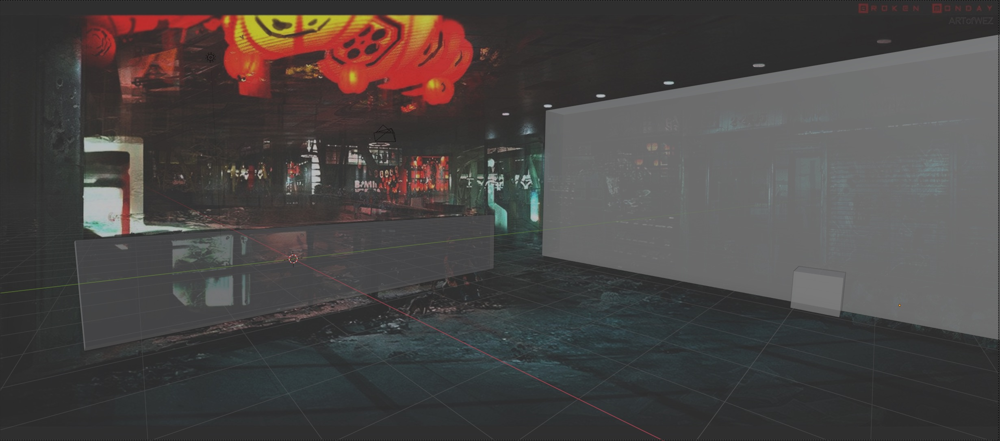
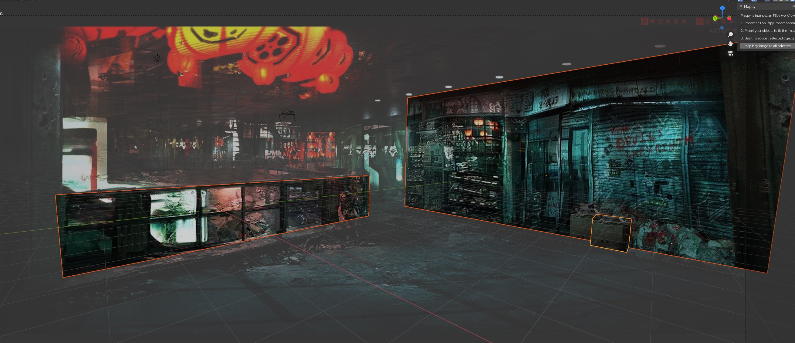

Im not ready to make a paid product yet, but if you want to help cover my cost of buying other peoples addons it would be appreciated :) 

# Blender_Mappy

Automates the Blender side of a FSpy workflow for all selected objects

short demo: https://youtu.be/dEeIGHfGSZ0

# fspy + geometry

# one button click map everything

fspy can be found at : https://fspy.io/
there are lots of good tutorials on how to use it with Blender, here's one: https://www.youtube.com/watch?v=p9IfDeNU8K0
but they only make one object to map a texture too, when I made several objects the workflow got tedious. So I spent 2 days automating what might take 2 minutes to do :)

1. adds the ratio settigns to the uv projector settings
2. creates a new texture material with the fspy image

for each of the selected objects
1. applies the subdivision modifier
2. applies the uv project modifier
3. applies the new texture material

## Install

1. download from Github click on the "Code" button
2. install it in prefences addon

## Use

1. Import you fspy project
2. create your geometry across as many objects as you want
3. open the "n" menu, and select "Mappy"
4. select all the objects you want to apply to
5. click the mappy button
